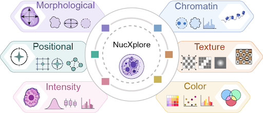

# NucXplore

NucXplore is a reproducible histopathology workflow for nucleus-level feature
extraction and cell-type prediction. The repository contains a Rust/PyO3 Python
package and a four-stage Nextflow pipeline.

<p align="center">
  
  <br>
  <sub>Nucleus-level feature families extracted by NucXplore.</sub>
</p>

## Components

| Component | Purpose |
|---|---|
| [`nucxplore/`](nucxplore/) | Fast feature extraction from RGB tiles and MATLAB instance maps. |
| [`nucxplore-pipeline/`](nucxplore-pipeline/) | WSI crop/filter, NucXplore segmentation, feature extraction, and cell-type prediction. |
| [`wiki/`](wiki/) | Detailed usage, parameters, containers, validation, and maintenance. |

Current package and pipeline version: **0.3.0**. Python 3.10 or newer is
required.

## Feature Extraction

```bash
python -m pip install \
  --index-url https://test.pypi.org/simple/ \
  --extra-index-url https://pypi.org/simple/ \
  "nucxplore[batch]==0.3.0"
```

```python
import nucxplore as nx

features = nx.extract_features_from_files(
    "tile.png",
    "tile.mat",
    mat_key="inst_map",
    use_gpu=False,
    feature_schema="legacy",
)
```

The image must be RGB. The MAT file must contain a two-dimensional instance
map where `0` is background and each positive integer identifies one nucleus.


| Schema | API columns | Use |
|---|---:|---|
| `legacy` | 130 | `nucleus_id` plus the 129 inputs required by the bundled model. |


## Nextflow Pipeline

Create the local environment used by crop/filter and feature extraction:

```bash
micromamba env create -f nucxplore-pipeline/environment.yml
```

Run from a local checkout:

```bash
nextflow run ./nucxplore-pipeline \
  --slide_root /data/slides \
  --outdir /data/results
```

Run the hosted repository by pinning a known tag or commit:

```bash
nextflow run the-ahuja-lab/NucXplore -r <release-tag> \
  --slide_root /data/slides \
  --outdir /data/results
```

Docker is the default engine for segmentation and prediction. Apptainer and
Singularity profiles are also provided. The default images are:

```text
ahujalab/nucxplore-seg:latest
ahujalab/nucxplore-cell-type-prediction:latest
```

### Reproducible demo

Run the complete workflow on the public `GTEX-1117F-0126.svs` example:

```bash
bash nucxplore-pipeline/examples/demo/run_demo.sh full
```

Or start from eight prepared image/MAT pairs to exercise feature extraction and
prediction without WSI cropping or segmentation:

```bash
bash nucxplore-pipeline/examples/demo/run_demo.sh intermediate
```

The launcher downloads checksum-pinned assets from the
[`demo-data-v1` release](https://github.com/the-ahuja-lab/NucXplore/releases/tag/demo-data-v1).
See the [demo guide](nucxplore-pipeline/examples/demo/README.md) for CPU/CUDA,
local-asset, resume, storage, and output details.

The prediction image contains the 129-feature XGBoost model and matching label
encoder supplied in `WSI_Sample_Adnan`. It produces one of eight labels:
`Adipocyte`, `Arrector pili`, `Blood vessel`, `Fibroblast`, `Hair Follicle`,
`Keratinocyte`, `Sebaceous Gland`, or `Sweat Gland`. Artifact hashes and this
label contract are recorded in
[`model_manifest.json`](nucxplore-pipeline/models/model_manifest.json).

## Pipeline Outputs

| Path under `outdir` | Contents |
|---|---|
| `features/` | Per-tile feature CSVs and schema sidecars. |
| `predictions/` | Feature CSVs with `Predicted_Label` and `Confidence_Score`. |
| `nuclei/` | Optional masked nucleus PNG crops. |
| `logs/` | Stage and prediction manifests/logs. |
| `crops/` | WSI tiles when `publish_crops=true`. |
| `segmentation_mats/` | Instance maps when `publish_segmentation=true`. |

## Validation

```bash
cd nucxplore
cargo fmt --all -- --check
cargo clippy --all-targets --all-features -- -D warnings
cargo test --all-targets --all-features

cd ../nucxplore-pipeline
python -m pytest -q
bash tests/run_stub_pipeline_checks.sh
```

CI runs Rust formatting/Clippy/tests, Python 3.10 and 3.12 wheel tests,
prediction contracts, and Nextflow stub contracts.

## Documentation

- [Package README](nucxplore/README.md)
- [Package user guide](nucxplore/docs/user-guide.md)
- [Pipeline README](nucxplore-pipeline/README.md)
- [Pipeline user guide](nucxplore-pipeline/docs/user-guide.md)
- [Pipeline parameters](wiki/Pipeline-Parameters.md)
- [Docker and validation](wiki/Docker-and-Validation.md)
- [Developer guide](wiki/Developer-Guide.md)

## License

The NucXplore package is licensed under the [MIT License](nucxplore/LICENSE).
