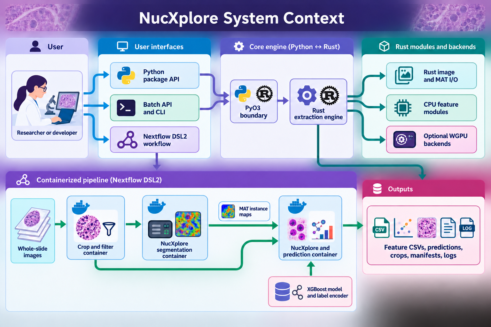
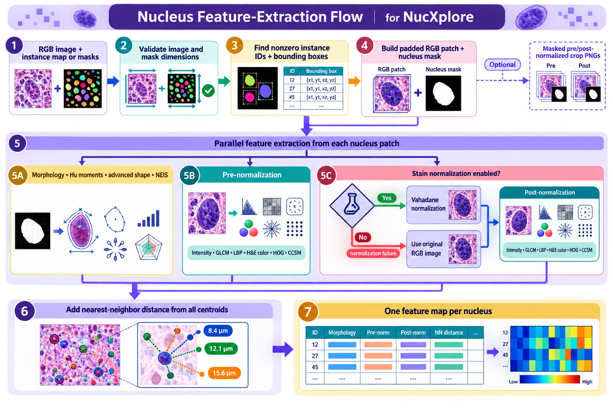
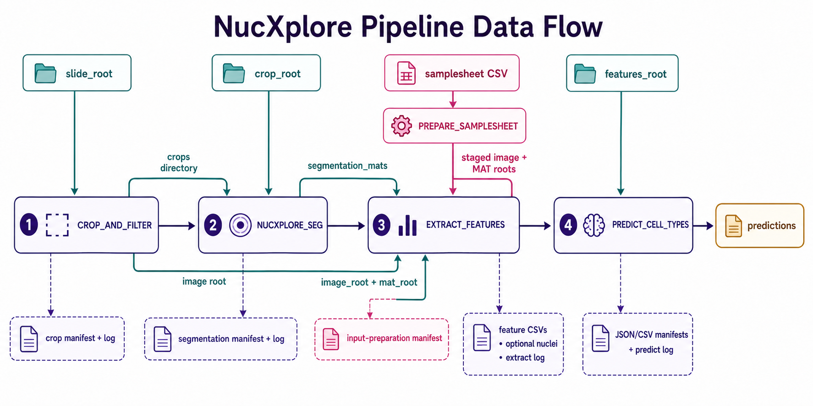
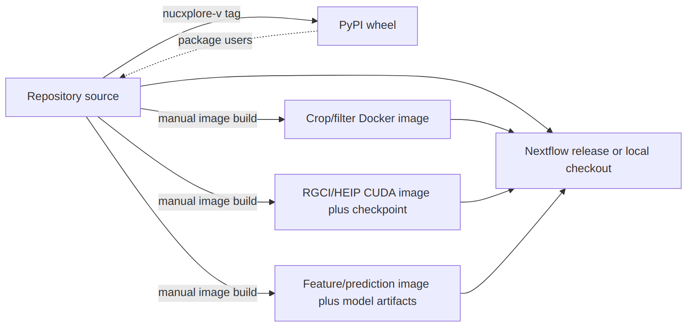

# Architecture

NucXplore combines a native nucleus-feature engine with a containerized workflow for whole-slide processing. The package and pipeline share the same feature-extraction implementation but can also be used independently: package users supply images and instance masks directly, while pipeline users can start from whole slides or any supported intermediate stage.

## System Context

[{ loading="lazy" }](assets/diagrams/architecture-system-context.png){ .diagram-link aria-label="Open the system context diagram at full resolution" }

The boundaries are deliberate:

- **Python** presents stable array, file, batch, and crop-export interfaces.
- **Rust** owns shape validation, native image/MAT loading, per-instance extraction, feature computation, and Python result conversion.
- **WGPU** accelerates selected HOG, GLCM, distance-transform, and CLAHE-related work when requested and available; CPU paths remain available.
- **Nextflow** validates stage ranges and inputs, connects process outputs to downstream inputs, applies containers, and publishes selected artifacts.
- **Docker images** isolate slide, segmentation, extraction, and prediction dependencies from the host.

## Package Architecture

### Public Interfaces

| Layer | Main interfaces | Responsibility |
|---|---|---|
| Python package | `extract_features`, `extract_features_from_files`, `save_cropped_nuclei_from_files` | Array/file access, optional crop export, Python-friendly results. |
| Python batch layer | `BatchExtractor`, `batch_extract_features`, `batch_extract_and_crop` | Pair discovery, metadata, parallel tasks, per-image CSVs, optional nucleus crops. |
| PyO3 module | `_core` | Typed boundary between NumPy/Python objects and native Rust routines. |
| Rust library | `io`, `features`, `gpu`, `stain_norm`, `core` | Validation, input decoding, native computation, normalization, errors, and reusable types. |

### Nucleus Feature-Extraction Flow

[{ loading="lazy" }](assets/diagrams/architecture-feature-extraction.png){ .diagram-link aria-label="Open the feature-extraction diagram at full resolution" }

Instance value `0` is background; every positive integer is a distinct nucleus. Regions are processed in sorted instance-ID order. Each nucleus receives a padded patch, while the nucleus mask prevents surrounding tissue from contributing as foreground.

### Feature Families

| Family | Implementation role | Execution path |
|---|---|---|
| Morphology and position | Area, perimeter, centroid, bounding geometry, convexity, and related measurements. | CPU |
| Moments and advanced shape | Hu moments, Fourier descriptors, bending energy, and additional contour descriptors. | CPU |
| Intensity | Masked grayscale distribution statistics. | CPU |
| Texture | GLCM and local binary pattern descriptors. | CPU; GLCM can use WGPU |
| Gradient structure | Histogram of oriented gradients. | CPU or WGPU |
| Chromatin / CCSM | Chromatin spatial and texture measurements using CLAHE, distance transforms, morphology, and mixture modeling. | CPU with selected WGPU operations |
| H&E color | Hematoxylin/eosin optical-density channel statistics. | CPU |
| Spatial context | Distance from each centroid to its nearest neighboring nucleus. | CPU after all nuclei are processed |

Patch-derived features are emitted with `pre_norm_` and `post_norm_` prefixes. Morphology, shape, nucleus ID, centroid, and nearest-neighbor fields are shared nucleus-level measurements. The environment variable `NUQR_ENABLE_STAIN_NORMALIZATION` controls whether the post-normalization feature path uses Vahadane-normalized pixels; normalization failures fall back to the original image.

### Package Outputs and Errors

- Array and file APIs return a list of numeric feature dictionaries, one per nucleus.
- Batch workflows write mirrored per-image CSVs and can attach instance-type metadata from MAT files.
- Crop export can write masked `pre_normalized_nuclei/` and `post_normalized_nuclei/` PNGs.
- Invalid image shapes, mismatched map dimensions, unreadable inputs, unsafe MAT-key selection, or failed feature computations return explicit errors rather than partial silent results.
- `use_gpu` selects accelerated implementations where supported; it does not move every feature family to the GPU.

## Nextflow Pipeline Architecture

### Main Data Flow and Alternate Entry Points

[{ loading="lazy" }](assets/diagrams/architecture-pipeline-flow.png){ .diagram-link aria-label="Open the pipeline data-flow diagram at full resolution" }

`from_stage` and `to_stage` select a contiguous range from `crop`, `segmentation`, `features`, and `prediction`. A run can therefore consume existing intermediate data without repeating upstream work:

| Entry stage | Required input | Flow |
|---|---|---|
| `crop` | `slide_root` | Complete workflow from whole-slide images. |
| `segmentation` | `crop_root` | Reuse prepared crop directories. |
| `features` with roots | `image_root` and `mat_root` | Pair mirrored relative image/MAT paths. |
| `features` with samplesheet | `samplesheet` | Validate rows and stage symlinked image/MAT roots before extraction. |
| `prediction` | `features_root` | Apply the bundled classifier to existing feature CSVs. |

### Stage Contracts

| Process | Compute and container boundary | Primary outputs |
|---|---|---|
| `CROP_AND_FILTER` | `crop_filter_container`; reads WSI formats with `tiffslide`, creates fixed-size tiles, and removes blank or partial tiles. | `crops/`, `crop_manifest.json`, `crop.log` |
| `RGCI_SEG` | `seg_container`; loads the baked HEIP checkpoint and requests a GPU when `seg_device=cuda`, with runtime CPU fallback if CUDA is unavailable. | `segmentation_mats/`, `segmentation_manifest.json`, `segment.log` |
| `PREPARE_SAMPLESHEET` | Nextflow task using the repository helper; validates required columns, uniqueness, and file existence, then stages symlinks. | Prepared image/MAT roots and `prepare_inputs_manifest.json` |
| `EXTRACT_FEATURES` | Shared feature/prediction container; runs the NucXplore batch CLI with configured workers, normalization, GPU, and crop flags. | `features/`, optional `nuclei/`, `extract.log` |
| `PREDICT_CELL_TYPES` | Shared feature/prediction container; loads the baked XGBoost model and label encoder and requires the model feature schema. | `predictions/`, `manifest.json`, `manifest.csv`, `predict.log` |

### Orchestration and Failure Behavior

- Parameter validation runs before channels are created. Invalid stages, reversed ranges, missing entry inputs, conflicting feature input modes, placeholder containers, or disabled model-schema enforcement stop the run.
- Nextflow connects directories between active processes; downstream stages consume work-directory artifacts even when optional intermediate publishing is disabled.
- `publish_crops` and `publish_segmentation` control whether large intermediate directories are copied to `outdir`. Feature CSVs, predictions, and logs are published by their owning stages.
- The global shell uses `bash -euo pipefail`, and the process error strategy is `terminate`, so a failed task stops the workflow.
- Prediction rejects missing model feature columns, reports empty CSVs as `skipped_empty`, and records per-file status in JSON and CSV manifests.

## Deployment Boundaries

[{ loading="lazy" }](assets/diagrams/architecture-deployment-boundaries.png){ .diagram-link aria-label="Open the deployment boundaries diagram at full resolution" }

Package wheels and pipeline containers have separate release boundaries. PyPI wheels are built from `nucxplore-v*` tags, while the pipeline Docker images are built and pushed manually. The segmentation checkpoint belongs in the CUDA segmentation image; the XGBoost model and label encoder belong in the feature/prediction image. Nextflow remains Docker-opt-in through the `docker` profile and uses local image tags before pulling when matching images are already present.

## Where to Go Next

- Use the [Package User Guide](Package-User-Guide.md) for API contracts, crops, batch extraction, and GPU behavior.
- Use the [Pipeline User Guide](Pipeline-User-Guide.md) for complete and partial run commands.
- Use [Pipeline Parameters](Pipeline-Parameters.md) for all configurable stage and container values.
- Use [Docker and Validation](Docker-and-Validation.md) for image builds, smoke runs, and reference comparisons.
- Use the [Developer Guide](Developer-Guide.md) for build, test, release, and maintenance workflows.
