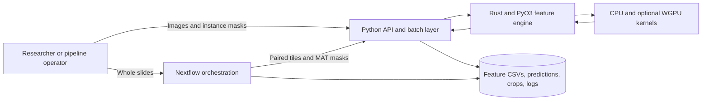
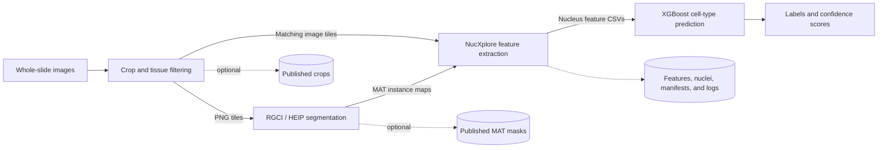

# NucXplore

**NucXplore is a high-performance toolkit for extracting interpretable nucleus-level features from histopathology images and running whole-slide cell-type prediction workflows.** It combines a Rust and PyO3 feature engine with a Docker-backed Nextflow pipeline, supporting focused Python analysis as well as reproducible processing from whole-slide images to classified nuclei.

---

{ width="100%" }

---

## Overview

NucXplore turns segmented nuclei into structured, analysis-ready measurements. Its feature engine captures six complementary views of nuclear phenotype:

- **Morphological** — size, shape, contour, and geometric measurements.
- **Chromatin** — nuclear organization and chromatin distribution descriptors.
- **Texture** — spatial intensity patterns and texture statistics.
- **Color** — channel-level and color-distribution measurements.
- **Intensity** — signal distribution and summary statistics.
- **Positional** — centroid and spatial-context measurements.

Use the package directly when you already have image tiles and nucleus instance masks. Use the Nextflow pipeline when you need an end-to-end, containerized workflow covering slide cropping, segmentation, feature extraction, and cell-type prediction.

## How NucXplore Works

NucXplore separates orchestration from computation. Nextflow coordinates reproducible, containerized stages; the Python API and batch layer provide user-facing interfaces; and the Rust engine performs nucleus-level feature computation with optional WGPU acceleration for selected algorithms.



[Explore the complete package and pipeline architecture →](Architecture.md)

## Two Ways to Use NucXplore

| Workflow | Best for | Start here |
|---|---|---|
| **Python package** | Extracting nucleus features from image and MAT mask pairs, exporting crops, and integrating features into Python analyses. | [Package User Guide](Package-User-Guide.md) |
| **Nextflow pipeline** | Reproducible whole-slide processing with Docker, optional stage reuse, published outputs, and cell-type predictions. | [Pipeline User Guide](Pipeline-User-Guide.md) |

## Python Quick Start

Install the package:

```bash
python -m pip install nucxplore
```

Extract features from an image and a MATLAB instance map:

```python
import nucxplore as nx

features = nx.extract_features_from_files(
    "tile.png",
    "tile.mat",
    use_gpu=False,
)

print(f"Extracted features for {len(features)} nuclei")
```

The MAT file must contain a 2D instance map in which `0` represents background and each positive integer identifies one nucleus. See the [Package User Guide](Package-User-Guide.md) for array APIs, batch extraction, crop export, feature groups, and GPU behavior.

## Whole-Slide Pipeline Quick Start

Run the hosted workflow with Docker:

```bash
nextflow run <org>/<repo> -r <tag> -profile docker \
  --slide_root /data/slides \
  --outdir /data/results
```

From a local checkout:

```bash
nextflow run . -profile docker \
  --slide_root /data/slides \
  --outdir /data/results
```

The pipeline can run end to end or resume from prepared crops, segmentation masks, feature tables, or prediction inputs. Review the [Pipeline Parameters](Pipeline-Parameters.md) before configuring stage inputs, containers, GPU execution, or intermediate publishing.

## End-to-End Workflow



## Documentation

| Guide | Contents |
|---|---|
| [Architecture](Architecture.md) | System boundaries, feature-engine internals, pipeline data flow, entry modes, containers, and outputs. |
| [Package User Guide](Package-User-Guide.md) | Installation, input contracts, Python APIs, crop export, batch extraction, and GPU behavior. |
| [Pipeline User Guide](Pipeline-User-Guide.md) | Full and partial Nextflow runs, input modes, outputs, failure behavior, and troubleshooting. |
| [Pipeline Parameters](Pipeline-Parameters.md) | Current stage, input, container, publishing, extraction, and prediction parameters. |
| [Docker and Validation](Docker-and-Validation.md) | Runtime image contracts, local builds, smoke runs, stub checks, and reference CSV validation. |
| [Developer Guide](Developer-Guide.md) | Package and pipeline development, releases, Docker publishing, and documentation maintenance. |

## Project Components

| Component | Repository path | Purpose |
|---|---|---|
| NucXplore package | `nucxplore/` | Rust and PyO3 feature engine with Python wrappers. |
| NucXplore pipeline | `nucxplore-pipeline/` | Docker-backed Nextflow workflow for whole-slide processing. |
| Docker references | `Docker_References/` | Verified feature and prediction outputs used for validation. |

For source code, releases, and issue tracking, visit the [NucXplore GitHub repository](https://github.com/the-ahuja-lab/NucXplore).
